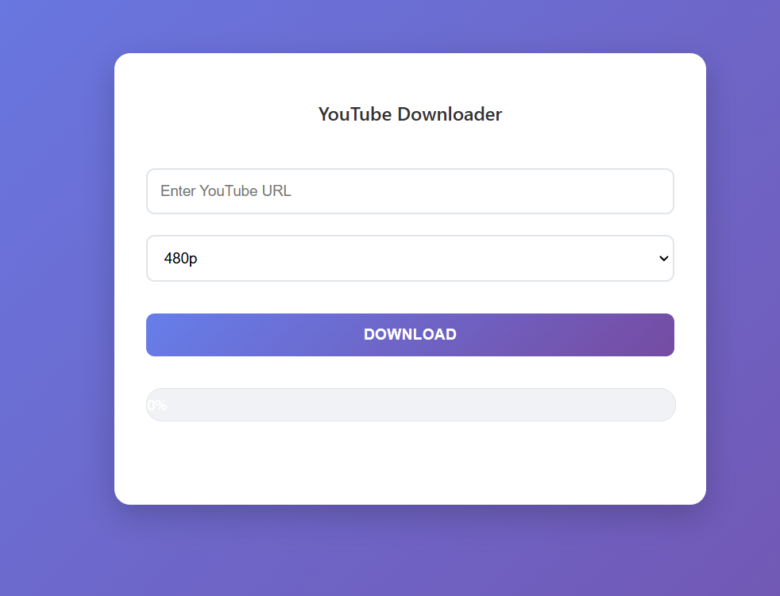

# My Project

A simple YouTube video downloader with Flask and yt-dlp.

## Screenshots

##  Features

- Select video quality (360p, 480p, 720p, 1080p).
- Progress bar displays download status.
- Downloads saved in a dedicated folder.
- Simple UI built with HTML, CSS, and vanilla JavaScript.

---

##  Installation & Usage

git clone https://github.com/shreyu3210/YoutubeDownloader.git
cd YoutubeDownloader
python -m venv venv && source venv/bin/activate  # or `venv\Scripts\activate` on Windows
pip install -r requirements.txt
python app.py
